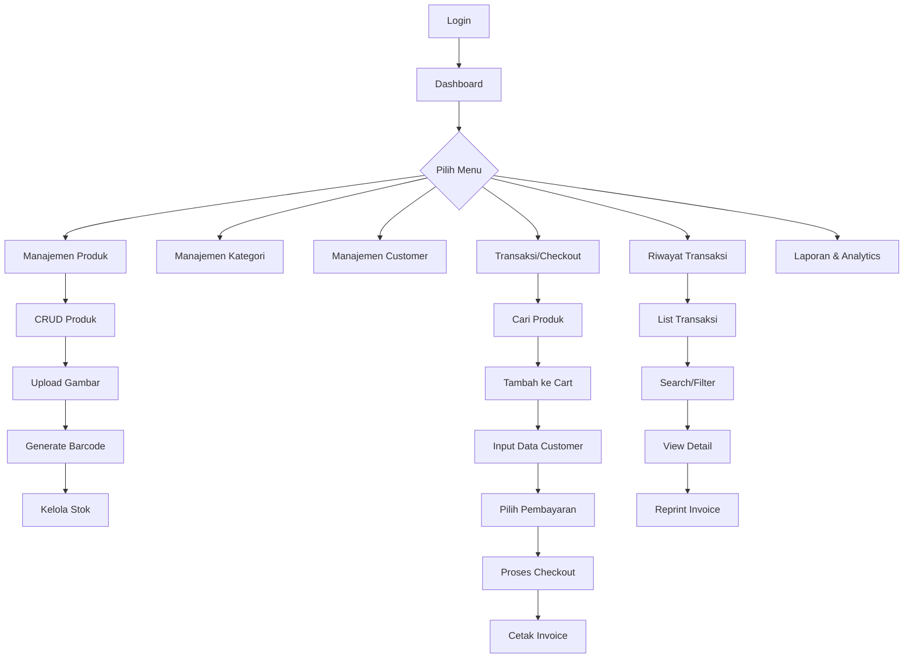
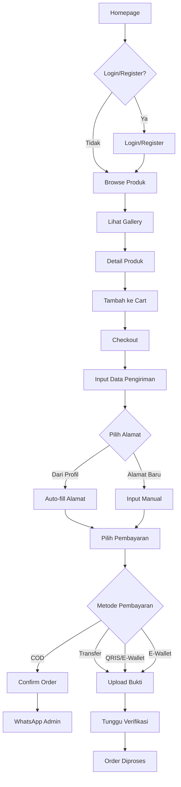

# 🛒 Aplikasi Kasir (Point of Sales)

Sistem Point of Sales (POS) modern berbasis web yang dibangun dengan Laravel 11 dan React. Aplikasi ini dirancang untuk mengelola operasional toko dengan fitur lengkap mulai dari manajemen produk, transaksi penjualan, hingga pelaporan keuntungan.

## 📋 Daftar Isi

- [Tech Stack](#tech-stack)
- [Struktur Project](#struktur-project)
- [Penjelasan Project](#penjelasan-project)
- [User Flow](#user-flow)
  - [Admin/Cashier](#admincashier)
  - [Customer](#customer)
- [Fitur](#fitur)
  - [Fitur Admin/Cashier](#fitur-admincashier)
  - [Fitur Customer](#fitur-customer)
- [Instalasi](#instalasi)
- [Lisensi](#lisensi)

---

## 🛠️ Tech Stack

### Backend
- **Laravel 11.x** - PHP Framework modern
- **Inertia.js** - Bridge antara Laravel & React tanpa API
- **MySQL 8.0** - Database relasional
- **Redis** - Caching & session management
- **Spatie Laravel Permission** - Role & Permission management

### Frontend
- **React 18.2** - UI Library
- **TailwindCSS 3.2** - Utility-first CSS framework
- **Axios** - HTTP client
- **Headless UI** - Unstyled UI components
- **React Hot Toast** - Notification system
- **SweetAlert2** - Dialog notifications
- **JSBarcode** - Barcode generator
- **Dexie.js** - IndexedDB untuk offline support

### Infrastructure
- **Docker & Docker Compose** - Containerization
- **Nginx** - Web server
- **PHP 8.2** - Runtime environment
- **Vite 5.0** - Build tool

---

## 📁 Struktur Project

```
kasir-app/
├── app/                          # Logika aplikasi (Backend)
│   ├── Http/
│   │   ├── Controllers/          # Mengatur permintaan HTTP
│   │   │   ├── Apps/            # Controller fitur utama
│   │   │   │   ├── CategoryController.php
│   │   │   │   ├── CustomerController.php
│   │   │   │   ├── ProductController.php
│   │   │   │   ├── TransactionController.php
│   │   │   │   └── SaleController.php
│   │   │   ├── UserController.php
│   │   │   ├── RoleController.php
│   │   │   ├── PermissionController.php
│   │   │   ├── ProfileController.php
│   │   │   └── FECheckoutController.php
│   │   ├── Middleware/           # Middleware untuk autentikasi & validasi
│   │   └── Requests/             # Form request validation
│   ├── Models/                   # Model database
│   │   ├── User.php
│   │   ├── Product.php
│   │   ├── Category.php
│   │   ├── Customer.php
│   │   ├── Transaction.php
│   │   ├── TransactionDetail.php
│   │   ├── Cart.php
│   │   └── Profit.php
│   └── Providers/                # Service providers
│
├── database/                     # Database management
│   ├── migrations/              # Migrasi database (schema)
│   ├── seeders/                 # Data seeding (dummy data)
│   └── factories/               # Factory untuk testing
│
├── resources/                    # Frontend resources
│   ├── views/                   # Blade templates
│   ├── js/                      # React components
│   │   ├── Pages/              # Halaman-halaman aplikasi
│   │   ├── Components/         # Reusable components
│   │   └── Layouts/            # Layout templates
│   └── css/                     # Stylesheet
│
├── routes/                       # Konfigurasi route
│   ├── web.php                  # Web routes
│   ├── auth.php                 # Authentication routes
│   └── console.php              # Console routes
│
├── public/                       # Public assets
│   ├── storage/                # File uploads (produk, kategori, dll)
│   ├── assets/
│   ├── css/
│   ├── js/
│   └── images/
│
├── storage/                      # Cache & logs
│   ├── app/                    # File storage
│   ├── framework/              # Cache files
│   └── logs/                   # Application logs
│
├── config/                       # Konfigurasi aplikasi
├── bootstrap/                    # Bootstrap aplikasi
├── docker/                       # Docker configuration
├── tests/                        # Unit & Feature tests
├── vendor/                       # Dependencies (Composer)
├── node_modules/                 # Dependencies (NPM)
│
├── docker-compose.yml           # Docker Compose config
├── Dockerfile                    # Docker image config
├── docker-entrypoint.sh          # Container entrypoint
├── docker-setup.sh               # Setup automation script
├── vite.config.js               # Vite bundler config
├── tailwind.config.js           # TailwindCSS config
├── package.json                 # Node.js dependencies
├── composer.json                # PHP dependencies
└── .env.example                 # Environment variables template
```

---

## 📖 Penjelasan Project

Aplikasi Kasir ini adalah sistem **Point of Sales (POS)** yang komprehensif untuk mengelola operasional toko retail. Sistem ini mendukung multi-role (Admin, Cashier, Customer) dengan fitur lengkap mulai dari manajemen produk, transaksi, hingga pelaporan.

### Keunggulan Utama:
- ✅ **Multi-role System** - Admin, Cashier, dan Customer dengan akses berbeda
- ✅ **Real-time Transaction** - Proses checkout cepat dengan cart system
- ✅ **Payment Gateway Ready** - Support COD, Transfer, E-Wallet, QRIS
- ✅ **Shipping Management** - Integrasi ongkos kirim berbasis lokasi (Jabodetabek)
- ✅ **Profit Tracking** - Perhitungan keuntungan otomatis per transaksi
- ✅ **Barcode System** - Generate barcode produk otomatis
- ✅ **Responsive Design** - UI modern dengan TailwindCSS
- ✅ **Offline Capable** - IndexedDB untuk cart saat offline
- ✅ **Docker Support** - Easy deployment dengan Docker

### Database Schema:
Sistem ini menggunakan 10 tabel utama:
- `users` - Data pengguna (Admin, Cashier)
- `customers` - Data pelanggan
- `categories` - Kategori produk
- `products` - Produk dengan barcode & stok
- `transactions` - Transaksi utama
- `transaction_details` - Detail item per transaksi
- `carts` - Keranjang belanja (temporary)
- `profits` - Tracking keuntungan
- `roles` & `permissions` - Role-based access control

---

## 🔄 User Flow

### Admin/Cashier



**Alur Kerja Admin/Cashier:**
1. **Login** ke sistem dengan credentials
2. **Dashboard** - Melihat overview transaksi hari ini
3. **Manajemen Data Master:**
   - Tambah/Edit/Hapus Produk
   - Kelola Kategori
   - Kelola Data Customer
4. **Transaksi Penjualan:**
   - Cari produk by nama/barcode
   - Tambah ke cart
   - Input data pengiriman
   - Pilih metode pembayaran
   - Proses checkout & cetak invoice
5. **Riwayat Transaksi:**
   - Lihat semua transaksi
   - Filter by tanggal/customer
   - View detail & reprint invoice
6. **Laporan:**
   - Analytics penjualan
   - Laporan keuntungan
   - Top products/customers

---

### Customer



**Alur Kerja Customer:**
1. **Browse Produk** - Melihat produk tanpa login
2. **Register/Login** - Untuk checkout perlu akun
3. **Update Profil** - Isi alamat, kota, provinsi
4. **Shopping:**
   - Lihat gallery produk
   - Detail produk & harga
   - Tambah ke cart
5. **Checkout:**
   - Pilih alamat (dari profil/baru)
   - Pilih metode pengiriman (Reguler/Express/Same Day)
   - Pilih pembayaran (COD/Transfer/QRIS/E-Wallet)
6. **Pembayaran:**
   - **COD**: Langsung confirm, redirect ke WhatsApp admin
   - **Transfer/QRIS**: Upload bukti pembayaran, tunggu verifikasi
7. **Order Tracking** - Lihat status order di profil

---

## ⭐ Fitur

### Fitur Admin/Cashier

#### 1. **Dashboard**
- Overview transaksi hari ini
- Total revenue & profit
- Grafik penjualan
- Top products
- Recent transactions

#### 2. **Manajemen Produk**
- ✅ CRUD Produk (Create, Read, Update, Delete)
- ✅ Upload gambar produk
- ✅ Generate barcode otomatis
- ✅ Tracking harga beli & jual
- ✅ Manajemen stok (auto-decrement saat transaksi)
- ✅ Filter by kategori
- ✅ Search produk (nama/barcode)

#### 3. **Manajemen Kategori**
- ✅ CRUD Kategori
- ✅ Upload gambar kategori
- ✅ Deskripsi kategori

#### 4. **Manajemen Customer**
- ✅ CRUD Customer
- ✅ Data lengkap (nama, no_telp, address, city, province)
- ✅ Riwayat pembelian customer

#### 5. **Transaksi/Checkout (Point of Sales)**
- ✅ Cart system (add, edit qty, remove)
- ✅ Real-time search produk
- ✅ Multiple payment methods (COD, Transfer, E-Wallet, QRIS)
- ✅ Diskon per transaksi
- ✅ Perhitungan ongkos kirim otomatis (Jabodetabek)
- ✅ Generate invoice otomatis
- ✅ Cetak receipt/struk (thermal printer 80mm compatible)
- ✅ Perhitungan keuntungan otomatis

#### 6. **Riwayat Transaksi**
- ✅ List semua transaksi completed
- ✅ Search by invoice/customer/date
- ✅ Filter by cashier/date range
- ✅ View detail transaksi
- ✅ Reprint invoice
- ✅ Upload bukti pembayaran (untuk Transfer/QRIS)

#### 7. **User & Role Management**
- ✅ Multi-role system (Super Admin, Admin, Cashier)
- ✅ Fine-grained permissions
- ✅ Dynamic role assignment
- ✅ User management

#### 8. **Profile Management**
- ✅ Update profil user
- ✅ Upload avatar
- ✅ Change password
- ✅ Delete account

#### 9. **Laporan & Analytics**
- ✅ Transaction history
- ✅ Profit tracking
- ✅ Dashboard overview
- ✅ Top products (paling laris)
- ✅ Top customers (paling sering beli)

---

### Fitur Customer

#### 1. **Homepage & Gallery**
- ✅ Browse produk tanpa login
- ✅ Gallery produk dengan kategori
- ✅ Search produk
- ✅ Detail produk (harga, deskripsi, stok)

#### 2. **Authentication**
- ✅ Register (email verification)
- ✅ Login
- ✅ Forgot password
- ✅ Email verification

#### 3. **Profile Management**
- ✅ Update profil (nama, email, phone)
- ✅ Alamat lengkap (address, city, province)
- ✅ Upload avatar
- ✅ Change password

#### 4. **Shopping Cart**
- ✅ Tambah produk ke cart
- ✅ Edit quantity
- ✅ Remove item
- ✅ Cart persistence (localStorage/IndexedDB)
- ✅ Offline capable

#### 5. **Checkout**
- ✅ Pilih alamat (dari profil/baru)
- ✅ Auto-fill data dari profil
- ✅ Pilihan pengiriman (Reguler/Express/Same Day)
- ✅ Ongkos kirim otomatis (berbasis lokasi Jabodetabek)
- ✅ Multiple payment methods:
  - **COD** - Bayar di tempat
  - **Transfer** - Transfer bank + upload bukti
  - **QRIS** - Scan QRIS + upload bukti
  - **E-Wallet** - E-wallet payment + upload bukti
- ✅ Diskon (jika ada)
- ✅ WhatsApp integration (auto-message ke admin)

#### 6. **Order Tracking**
- ✅ Riwayat transaksi
- ✅ Status order (pending, processing, shipping, delivered)
- ✅ View detail invoice
- ✅ Upload bukti pembayaran

---

## 🚀 Instalasi

### Quick Start (Docker)

```bash
# 1. Clone repository
git clone https://github.com/aryadwiputra/point-of-sales
cd point-of-sales

# 2. Run setup script
./docker-setup.sh

# 3. Access application
# Frontend: http://localhost:8000
# MySQL: localhost:3306
# Redis: localhost:6379
```

### Manual Installation

```bash
# 1. Clone & install dependencies
git clone https://github.com/aryadwiputra/point-of-sales
cd point-of-sales
composer install
npm install

# 2. Setup environment
cp .env.example .env
php artisan key:generate

# 3. Configure database di .env
# DB_CONNECTION=mysql
# DB_DATABASE=kasir_db
# DB_USERNAME=root
# DB_PASSWORD=your_password

# 4. Migrate & seed
php artisan migrate --seed

# 5. Link storage & build assets
php artisan storage:link
npm run build

# 6. Run server
php artisan serve
```

### Default Credentials

**Super Admin:**
- Email: `admin@sniffy.com`
- Password: `password`

**Cashier:**
- Email: `cashier@sniffy.com`
- Password: `password`

---

## 📄 License

This project is open-sourced software licensed under the [MIT license](https://opensource.org/licenses/MIT).

---

## 📞 Support

Untuk pertanyaan atau bantuan, silakan hubungi:
- Email: aryadwiputra@example.com
- GitHub Issues: [Create an issue](https://github.com/aryadwiputra/point-of-sales/issues)

---

**Dibuat dengan ❤️ menggunakan Laravel & React**
